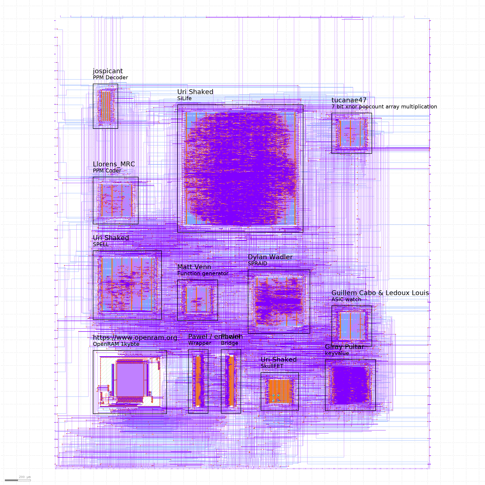
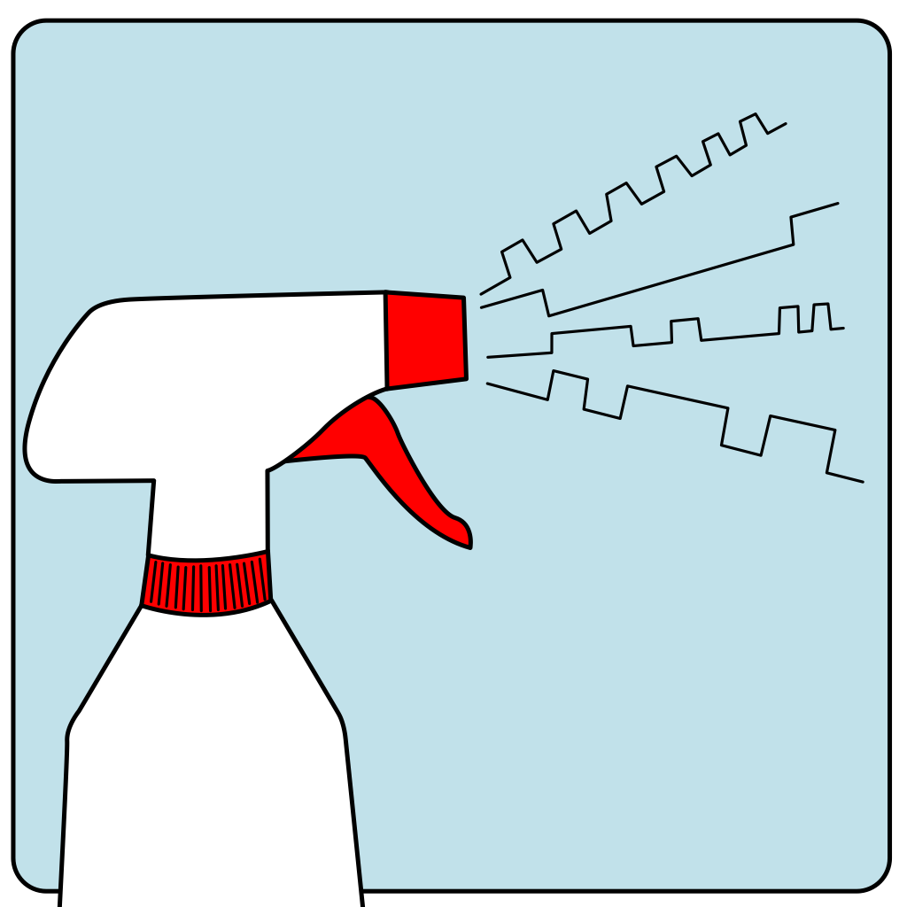

# Zero to ASIC Course MPW4

This ASIC was designed by members of the [Zero to ASIC course](https://zerotoasiccourse.com).

This submission was configured and built by the [multi project tools](https://github.com/mattvenn/multi_project_tools) at commit 46a776b27ff3d422db1e3554d6e046daf8806ea5

    # clone all repos, and include support for shared OpenRAM
    ./multi_tool.py --clone-repos --clone-shared-repos --create-openlane-config --copy-gds --copy-project --openram

    # run all the tests
    ./multi_tool.py --test-all --force-delete

    # build user project wrapper submission
    cd $CARAVEL_ROOT; make user_project_wrapper

    # create docs
    ./multi_tool.py --generate-doc --annotate-image

## Function generator

* Author: Matt Venn
* Github: https://github.com/mattvenn/wrapped_function_generator
* commit: 0d95d94d816685ab9eea70fbbfb2425a8b91c27e
* Description: arbitary function generator, using shared RAM as the output data

## SPELL

* Author: Uri Shaked
* Github: https://github.com/wokwi/wrapped_spell
* commit: 4db5165ac2e450a62a249285c1a7374a836b5167
* Description: SPELL CPU (https://skullctf.com/spell)

## PPM Coder

* Author: Llorens_MRC
* Github: https://github.com/mattvenn/wrapped_ppm_coder
* commit: bbcb465d5d149a501b1cc67cfe4b344383a15a7e
* Description: Fuentes Codificador PPM configurable

## PPM Decoder

* Author: jospicant
* Github: https://github.com/mattvenn/wrapped_ppm_decoder
* commit: 8d21fed5cbce7c04cdc739226e6ea9167774f7c7
* Description: Fuentes Codificador PPM configurable

## SiLife

* Author: Uri Shaked
* Github: https://github.com/wokwi/wrapped_silife
* commit: c3eb7d8bdaa1953ecf13adc21d33dd4326a559c9
* Description: Game of Life, in Silicon

## SkullFET

* Author: Uri Shaked
* Github: https://github.com/wokwi/wrapped_skullfet
* commit: c583f431e0b6f280f91520725f313aebbab86fdd
* Description: Barebone MOSFET transistors

## SPRAID

* Author: Dylan Wadler
* Github: https://github.com/bit0fun/spraid_mpw4
* commit: 783bea43f33531757a7beadc4c3e0dd347f8571a
* Description: SPI RAID Controller: Supports RAID0, RAID1, RAID5 with 4 SPI Flash devices

## ASIC watch

* Author: Guillem Cabo & Ledoux Louis
* Github: https://github.com/Bynaryman/wrapped_asic_watch
* commit: d19b10006c3247f6a11fd3e14d854422d85ab37d
* Description: a 7 segment fashion watch targeting asic and sky130 process node

## keyvalue

* Author: Giray Pultar
* Github: https://github.com/giraypultar/wrapped_keyvalue
* commit: 76cd2077ca5f684f8ccdda93b79bef78c675a149
* Description: key value store

## 7 bit xnor popcount array multiplication

* Author: tucanae47
* Github: https://github.com/tucanae47/wrapped_bin_mult
* commit: 0764fe1bf1ffcbca5dfb86d68c8e37c3319b6266
* Description: description

